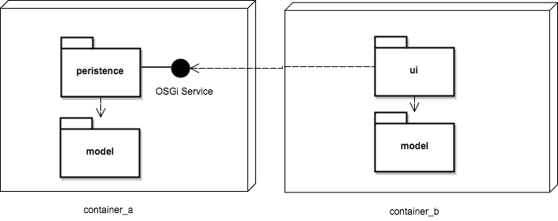

# {{page.title}}

By default OSGi services are only visible and accessible in the OSGi container where they are published. Distributed OSGi allows to define services in one container and use them in some other (even over machine boundaries).

For this tutorial we use the DOSGi sub project of CXF which is the reference implementation of the OSGi Remote Service Admin specification, chapter 122 in the OSGi 4.2 Enterprise Specification).

[Example on github](https://github.com/cschneider/Karaf-Tutorial/tree/master/dosgi)

## Introducing the example

Following the hands on nature of these tutorial we start with an example that can be tried in some minutes and explain the details later.

Our example is again the tasklist example from Part 1 of this tutorial. The only difference is that we now deploy the model and the persistence service on container A and model and UI to container B and we install the dosgi runtime on bother containers.µ



As DOSGi should not be active for all services on a system the spec defines that the service property "osgi.remote.interfaces" triggers if DOSGi should process the service. It expects the interface names that this service should export remotely. Setting the property to * means that all interfaces the service implements should be exported. The tasklist persistence service already sets the property so the service is exported with defaults.

## Installing the service

To keep things simple we will install container A and B on the same system.

* Download Apache Karaf 4.2.x
* Unpack karaf into folder container_a
* Start bin/karaf

```
feature:repo-add cxf-dosgi 2.3.0
feature:repo-add mvn:net.lr.tasklist/tasklist-features/1.0.0-SNAPSHOT/xml
feature:install aries-rsa-discovery-zookeeper-server cxf-dosgi-provider-ws example-tasklist-persistence
```

After these commands the tasklist persistence service should be running and be published on zookeeper.

You can check the wsdl of the exported service http://localhost:8181/cxf/net/lr/tasklist/model/TaskService?wsdl. By starting the zookeeper client zkCli.sh from a zookeeper distro you can optionally check that there is a node for the service below the osgi path.

## Installing the UI

Unpack into folder container_b
Start bin/karaf

```
config:property-set -p org.ops4j.pax.web org.osgi.service.http.port 8182
feature:repo-add cxf-dosgi 2.3.0
feature:repo-add mvn:net.lr.tasklist/tasklist-features/1.0.0-SNAPSHOT/xml
feature:install aries-rsa-discovery-zookeeper cxf-dosgi-provider-ws example-tasklist-ui
```

The tasklist client ui should be in status Active/Created and the servlet should be available on http://localhost:8182/tasklist. If the ui bundle stays in status graceperiod then DOSGi did not provide a local proxy for the persistence service.

## How does it work

The Remote Service Admin spec defines an extension of the OSGi service model. Using special properties when publishing OSGi services you can tell the DOSGi runtime to export a service for remote consumption. The CXF DOSGi runtime listens for all services deployed on the local container. It only processes services that have the "osgi.remote.interfaces" property. If the property is found then the service is either exported with the named interfaces or with all interfaces it implements.The way the export works can be fine tuned using the CXF DOSGi configuration options.

By default the service will be exported using the CXF servlet transport. The URL of the service is derived from the interface name. The servlet prefix, hostname and port number default to the Karaf defaults of "cxf", the ip address of the host and the port 8181. All these options can be defined using a config admin configuration (See the configuration options). By default the service uses the CXF Simple Frontend and the Aegis Databinding. If the service interface is annotated with the JAX-WS @WebService annotation then the default is JAX-WS frontend and JAXB databinding.

The service informations are then also propagated using the DOSGi discovery. In the example we use the Zookeeper discovery implementation. So the service metadata is written to a zookeeper server.

The container_b will monitor the local container for needed services. It will then check if a needed service is available on the discovery impl (on the zookeeper server in our case). For each service it finds it will create a local proxy that acts as an OSGi service implementing the requested interface. Incoming request are then serialized and sent to the remote service endpoint.

So together this allows for almost transparent service calls. The developer only needs to use the OSGi service model and can still communicate over container boundaries.
